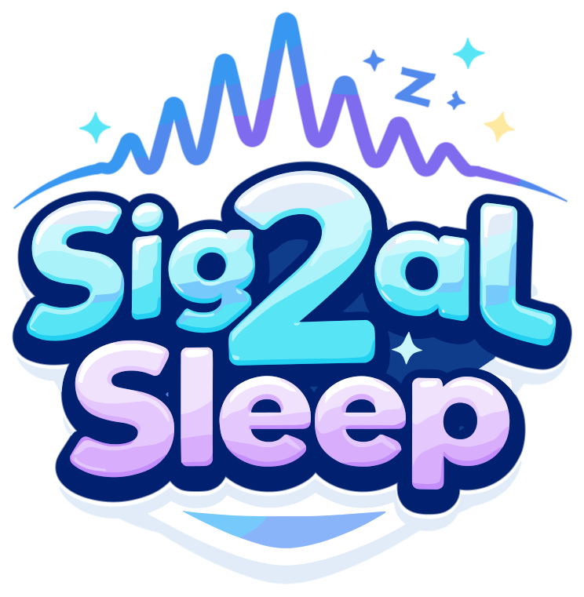

<p align="center">
  
</p>

<h3 align="center">Apple Watch sleep tracking & analysis platform</h3>

<p align="center">
  Stream sensor data from your Apple Watch via <a href="https://apps.apple.com/app/sensor-logger/id1531582925">Sensor Logger</a>, automatically detect sleep periods, and view detailed analysis on a real-time dashboard.
</p>

---

## What it does 

Signal-to-Sleep ingests raw sensor streams (heart rate, motion, HRV, noise, respiratory rate) from an Apple Watch running [Sensor Logger](https://apps.apple.com/app/sensor-logger/id1531582925) over MQTT. It then:

- **Detects sleep periods** automatically using an actigraphy-style algorithm combining heart rate drops and movement stillness
- **Classifies sleep stages** (Awake, Light, Deep, REM) in 30-second epochs using HR, HRV, and accelerometer data
- **Computes metrics** — recovery score, sleep quality, efficiency, onset latency, WASO, fragmentation index, time to deep/REM, and more
- **Displays everything** on an interactive Vue 3 dashboard with real-time WebSocket updates

## Architecture

```
┌──────────────┐     MQTT (WebSocket)     ┌─────────────┐    HTTP/WS    ┌──────────────┐
│ Apple Watch  │ ─────────────────────▶  │  Mosquitto  │ ◀──────────▶ │   FastAPI    │
│ Sensor Logger│                         │  Broker     │              │   Backend    │
└──────────────┘                         └─────────────┘              └──────┬───────┘
                                                                            │
                                                                       SQLite DB
                                                                            │
                                                                      ┌─────┴───────┐
                                                                      │  Vue 3 SPA  │
                                                                      │  (nginx)    │
                                                                      └─────────────┘
```

Three Docker containers orchestrated via Compose: an MQTT broker (Mosquitto 2), a Python backend (FastAPI + analysis engine), and a frontend (Vue 3 served by nginx).

## Quick start

### Prerequisites

- Docker & Docker Compose
- An Apple Watch with [Sensor Logger](https://apps.apple.com/app/sensor-logger/id1531582925) installed (Pro subscription required for MQTT streaming)
- `make` (optional but recommended)

### Demo mode (simulated data)

```bash
git clone https://github.com/doino-gretchenliev/signal-to-sleep.git
cd signal-to-sleep
make demo-start
```

This auto-generates MQTT credentials, builds containers, seeds 7 nights of synthetic sleep data, starts a live data streamer, and opens the dashboard in your browser.

To stop: `make demo-stop`

### Production mode (real Apple Watch)

```bash
make start
```

On first run, this auto-generates a random MQTT password (saved to `.env` and `mosquitto/passwd`) and prints the credentials. Subsequent starts reuse the existing password. Configure Sensor Logger on your Apple Watch to publish to your server's MQTT broker using the printed credentials (see [Sensor Logger setup](#sensor-logger-setup) below).

### Local development (no Docker)

```bash
make venv && make install    # Python backend
make dev                     # Start backend on :8080
make frontend-dev            # Vite dev server with HMR (separate terminal)
```

## Sensor Logger setup

[Sensor Logger](https://apps.apple.com/app/sensor-logger/id1531582925) is a third-party app that streams raw sensor data from your Apple Watch over MQTT. MQTT streaming requires the **Pro subscription** (lowest tier).

### 1. Install & subscribe

Install Sensor Logger on your iPhone (it acts as a bridge for Apple Watch sensors). Subscribe to Pro to unlock MQTT publishing.

### 2. Enable sensors

In Sensor Logger, enable the following sensors on your Apple Watch:

**Required** (sleep detection and staging depend on these):

- **Heart Rate** — primary signal for sleep detection, staging, and vitals
- **Wrist Motion** — 9-axis motion data used for movement analysis

**Recommended:**

- **Accelerometer** — fallback motion source if Wrist Motion is unavailable
- **Microphone (Loudness)** — ambient noise levels, powers the noise chart on the dashboard

Other sensors (pedometer, activity, gyroscope, brightness, etc.) are accepted and stored but not currently used in analysis. They may be used in future versions.

### 3. Configure MQTT

In Sensor Logger settings, set up MQTT publishing:

- **Broker URL:** `YOUR_SERVER`
- **Port:** `1884`
- **Connection Type:** WebSocket
- **Username:** `sleeptracker` (default, see `.env`)
- **Password:** auto-generated on first `make start` — printed to terminal and saved in `.env`
- **Topic:** `sensor-logger`

The server expects JSON messages with `sessionId`, `deviceId`, and a `payload` array of sensor readings. Sensor Logger handles this format natively — no additional configuration needed.

### 4. Record

Start a recording session on your Apple Watch before sleep. Sensor Logger streams data continuously to the MQTT broker, and Signal-to-Sleep picks it up in real time. Sleep periods are detected automatically as data flows in.

## Dashboard

The dashboard provides a comprehensive view of your sleep data:

- **Daily Summary** — combined totals when viewing multiple sessions (night + nap)
- **Sleep Timeline** — architectural view of your sleep stages over time
- **Score Cards** — recovery score, sleep quality, and efficiency gauges
- **Vital Cards** — resting heart rate and HRV
- **Sleep Metrics** — onset latency, WASO, awakenings, fragmentation index, time to deep/REM
- **Charts** — heart rate, movement, respiratory rate, noise level, stage distribution, and energy bank
- **Multi-session support** — select multiple periods to see combined daily totals with properly summed/weighted metrics

## Sleep detection

The auto-detection algorithm runs in the background and scans incoming sensor data for sleep periods. It works like simplified actigraphy:

1. Aggregates 1-minute bins of heart rate and movement magnitude
2. Scores each bin based on stillness (< 0.025g) and HR drop (> 12 bpm below baseline)
3. Detects sleep onset after 10+ consecutive calm minutes
4. Detects sleep offset after 20+ consecutive active minutes
5. Discards periods shorter than 20 minutes
6. Labels periods as "night" (3+ hours) or "nap"
7. Merges adjacent periods less than 60 minutes apart

Finalized periods are locked and won't be extended by subsequent detection runs.

## Sleep staging

Each detected period is analyzed in 30-second epochs:

| Stage     | Movement         | Heart Rate              | HRV      |
| --------- | ---------------- | ----------------------- | -------- |
| **Awake** | High or elevated | Above baseline          | —        |
| **Light** | Low              | Slightly below baseline | Moderate |
| **Deep**  | Minimal          | Lowest                  | Highest  |
| **REM**   | Minimal          | Near-wake levels        | Low      |

## Computed metrics

| Metric              | Description                                            |
| ------------------- | ------------------------------------------------------ |
| Recovery Score      | Overall recovery assessment (0–100%)                   |
| Sleep Quality       | Composite quality score (0–100%)                       |
| Sleep Efficiency    | Time asleep / time in bed                              |
| Onset Latency       | Minutes from bedtime to first sleep epoch              |
| WASO                | Wake After Sleep Onset — total awake minutes mid-sleep |
| Awakenings          | Number of wake-to-sleep transitions                    |
| Fragmentation Index | Awakenings per hour of sleep                           |
| Time to Deep        | Minutes from first sleep to first deep epoch           |
| Time to REM         | Minutes from first sleep to first REM epoch            |

## API

The backend exposes a RESTful API plus a WebSocket endpoint for real-time updates.

| Method   | Endpoint                    | Description                                        |
| -------- | --------------------------- | -------------------------------------------------- |
| `GET`    | `/api/health`               | Service health + DB/MQTT status                    |
| `GET`    | `/api/sleep-periods`        | List detected periods (filter by date)             |
| `POST`   | `/api/sleep-periods/manual` | Create a manual sleep period                       |
| `PUT`    | `/api/sleep-periods/{id}`   | Update period times/type                           |
| `DELETE` | `/api/sleep-periods`        | Delete periods + their analyses                    |
| `GET`    | `/api/analysis/{period_id}` | Fetch computed sleep metrics                       |
| `POST`   | `/api/analyze/{period_id}`  | Trigger background analysis                        |
| `POST`   | `/api/detect`               | Trigger sleep detection scan                       |
| `WS`     | `/ws`                       | Real-time events (analysis complete, data refresh) |

## Configuration

On first start, `make init` copies `.env.example` to `.env` and generates a random 24-character MQTT password. You can override any value afterward by editing `.env` directly:

| Variable        | Default                 | Description                           |
| --------------- | ----------------------- | ------------------------------------- |
| `MQTT_USERNAME` | `sleeptracker`          | MQTT broker username                  |
| `MQTT_PASSWORD` | *(auto-generated)*      | MQTT broker password                  |
| `MQTT_BROKER`   | `mosquitto`             | Broker hostname (Docker service name) |
| `MQTT_PORT`     | `1884`                  | MQTT WebSocket port                   |
| `MQTT_TOPIC`    | `sensor-logger`         | Sensor data topic                     |
| `WEB_PORT`      | `8080`                  | Dashboard port                        |
| `DATABASE_PATH` | `/app/db/sleep_data.db` | SQLite database path                  |

## Makefile reference

| Command                 | Description                                                             |
| ----------------------- | ----------------------------------------------------------------------- |
| `make init`             | Generate `.env` with random MQTT password (runs automatically on start) |
| `make demo-start`       | Full demo: build, seed, stream, open browser                            |
| `make demo-stop`        | Stop demo containers                                                    |
| `make start`            | Production start (real Apple Watch data)                                |
| `make build`            | Build Docker images                                                     |
| `make up` / `make down` | Start/stop containers                                                   |
| `make seed`             | Populate 7 nights of test data                                          |
| `make logs`             | Tail all container logs                                                 |
| `make dev`              | Local backend dev server                                                |
| `make frontend-dev`     | Vite dev server with HMR                                                |

## Tech stack

**Backend:** Python 3.12, FastAPI, SQLAlchemy, NumPy, SciPy, paho-mqtt

**Frontend:** Vue 3 (Composition API), D3.js, Vite, Flatpickr

**Infrastructure:** Docker, Mosquitto 2 (MQTT), nginx, SQLite

## License

[GPLv3 + Non-Commercial](LICENSE) — free to use, modify, and share for personal and non-commercial purposes. Any derivative work must remain open-source under the same terms. Commercial use requires written permission. See [LICENSE](LICENSE) for details.

---

<p align="center">Made by Gretch.</p>
